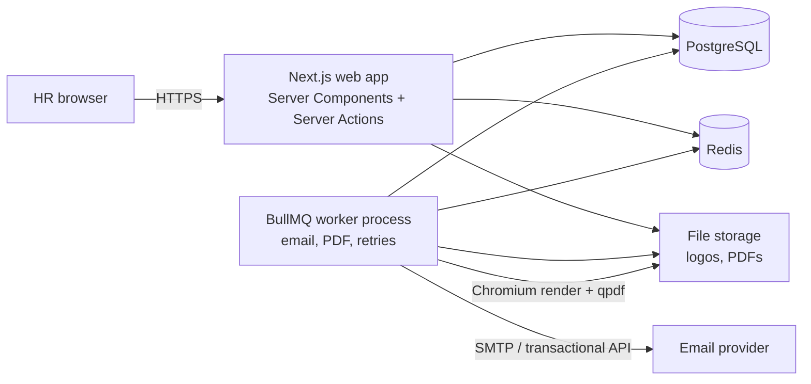
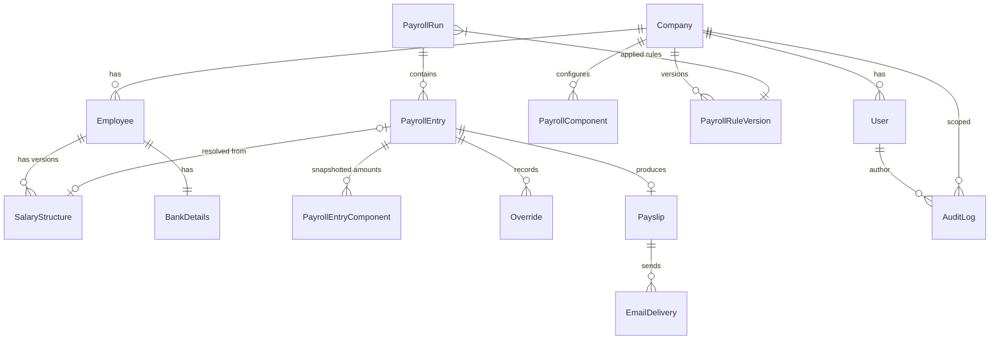
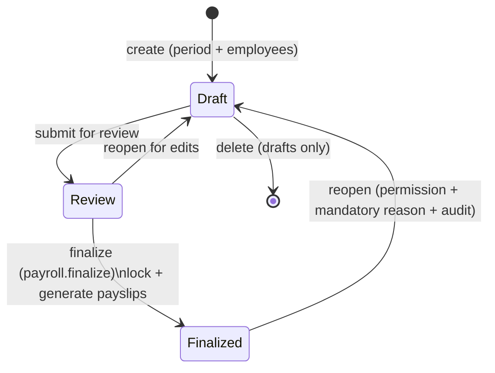

# Architecture — PayNest (MVP)

Companion to `_docs/plan.md` (product) and `_docs/tasks.md` (backlog).
Selected stack: **Next.js 15 full-stack (App Router) + React 19 + TypeScript**, per plan §67.

---

## 1. Goals and Constraints

The architecture must make these product principles (plan §63) hard to violate:

1. **Accuracy** — money math never loses precision; calculations are deterministic and testable.
2. **Auditability** — every mutation is attributable and recorded.
3. **Historical integrity** — finalized payroll, payslips, and applied rules are immutable snapshots.
4. **Human control** — overrides are possible but always reasoned and recorded.
5. **Future multi-company** — single company today, but every tenant entity carries a `companyId` so tenancy is a filter, not a redesign.

---

## 2. System Overview



Two Node processes, one codebase:

- **web** — Next.js (`next start`). Serves UI, runs Server Actions/API routes, owns all request handling.
- **worker** — long-running Node process that consumes BullMQ queues (email delivery, PDF generation, bulk-send fan-out). Keeps slow Chromium/SMTP work off the request path.

PostgreSQL is the source of truth. Redis holds queues and cache only — losing Redis loses in-flight jobs, not data (jobs are re-enqueueable; see idempotency in §11).

---

## 3. Technology Stack

| Concern | Choice | Notes |
|---|---|---|
| Framework | Next.js 15 (App Router), React 19, TypeScript (strict) | RSC for reads, Server Actions for writes |
| UI | Tailwind CSS 4 + shadcn/ui | One professional default look (plan §34) |
| ORM | Prisma | Migrations versioned in repo |
| Database | PostgreSQL 16+ | JSONB for breakdowns/audit diffs, sequences for payslip numbers |
| Auth | better-auth | Email/password sessions stored in DB; 2FA-ready later (plan §5) |
| Queues | BullMQ + Redis | Retries with backoff, delayed jobs, idempotency |
| Email | nodemailer behind a driver interface | Fake driver (dev/test), SMTP/transactional driver (prod) |
| Excel | exceljs | Official templates + fail-safe imports |
| PDF | Playwright Chromium → HTML-to-PDF; qpdf for encryption | Chromium lives in the worker image |
| Testing | Vitest (unit/integration), Playwright (E2E) | Fake email driver + fixture data |
| Runtime | Node 22 LTS | `web` and `worker` targets from one repo |

---

## 4. Code Layout and Layering

```
src/
  app/                     # Presentation: routes, layouts, pages, server actions
    (auth)/login/
    dashboard/
    employees/
    payroll/
    payslips/
    settings/
    audit/
    api/health/
  components/
    ui/                    # shadcn/ui primitives
    <feature>/             # feature components (client + server)
  lib/                     # thin shared utilities (formatting, errors)
  server/                  # SERVER-ONLY domain layer — no React imports
    auth.ts                # session + current user helpers
    permissions.ts         # role→permission catalog, requirePermission()
    services/              # employee.service.ts, payroll.service.ts, payslip.service.ts, ...
    payroll/
      engine.ts            # pure calculation engine (§9)
      rules.ts             # rule-version resolution
      breakdown.ts         # calculation transparency types
    email/
      driver.ts            # EmailDriver interface + FakeDriver/SmtpDriver
      queues.ts            # queue + job definitions
      templates.ts         # variable substitution
    pdf/
      render.ts            # HTML → PDF via Chromium
      encrypt.ts           # qpdf password protection
    storage/
      storage.ts           # StorageService interface (local disk now, S3 later)
    audit/
      audit.ts             # append-only audit writer + redaction
  jobs/
    worker.ts              # BullMQ worker bootstrap
    email.job.ts           # send/retry logic
    pdf.job.ts             # generate/encrypt logic

prisma/schema.prisma
tests/
  unit/                    # engine, permissions, masking, numbering
  integration/             # services against a test database
  e2e/                     # Playwright flows with FakeDriver
```

**Layering rules**

1. `app/` (pages, Server Actions) does validation, authorization (`requirePermission`), then calls `server/services`. UI never computes payroll or touches tables directly.
2. `server/services` owns transactions, state transitions, audit writes, and job enqueuing. Services are the only writers.
3. `server/payroll/engine.ts` is **pure**: no DB, no I/O, no clock. It receives amounts and a rule version and returns amounts plus breakdowns. This makes Nigerian tax math unit-testable in isolation.
4. `jobs/` calls the same services/driver interfaces — no duplicated business logic.

---

## 5. Key Decisions

### 5.1 Money: integer kobo, never floats

All monetary values are stored and computed as **integer kobo** (1/100 naira) in `BigInt` columns.

- Engine math is integer-only. Percentage computations round half-up to the nearest kobo (e.g. pension 8% of pensionable earnings). Rounding rule is fixed and documented in the engine, so results are reproducible.
- Display formatting happens only at the UI edge: `Intl.NumberFormat("en-NG", { style: "currency", currency: "NGN" })`.
- API boundaries serialize kobo as numbers ≤ 2^53 or strings; never floats.

### 5.2 Immutability and snapshots

| What | Mechanism |
|---|---|
| Employee salary | Immutable `SalaryStructure` rows with `effectiveFrom`; never updated, new row per change (plan §13) |
| Tax/pension/NHF rules | `PayrollRuleVersion` rows with `effectiveFrom`; run records the `ruleVersionId` applied (plan §16) |
| Payroll entry | On calculate, component amounts are **copied** into `PayrollEntryComponent` rows; the entry references the source `salaryStructureId` but does not depend on it (plan §22) |
| Finalized run | All rows of the run become read-only at the service level; corrections go through reopen → new edit → re-finalize (plan §§27–29) |
| Payslip | A payslip captures everything it prints (components, totals, company display data); regenerating after correction supersedes, never overwrites history |
| Audit log | Append-only; no UPDATE/DELETE paths |

### 5.3 Multi-company readiness

Every tenant-scoped table (`Employee`, `PayrollRun`, `Payslip`, settings, users, …) includes `companyId`. A single company is seeded at setup; services accept/derive the active company from the session. No queries are allowed without a `companyId` filter (enforced by convention + review; a Prisma middleware guard can be added later).

---

## 6. Domain Model



Key entities (abridged; Prisma schema is the source of truth once Task #2 lands):

| Entity | Purpose / notable fields |
|---|---|
| `Company` | Identity, TIN, contact, branding, payslip number format, toggles (auto-send, PDF passwords) |
| `User` | Auth account, `role`, `companyId` |
| `Employee` | Profile, `employeeCode` (unique per company), `status`, created/updated-by metadata |
| `BankDetails` | One per employee; account number masked in all read paths except explicit permission |
| `SalaryStructure` | `effectiveFrom`, `reason`, per-component amounts (JSON or child rows) — immutable |
| `PayrollComponent` | Catalog: name, `kind` (earning/deduction), `system` flag (PAYE/Pension/NHF = rule-calculated), active flag |
| `PayrollRuleVersion` | PAYE bands + relief params, pension %, NHF %, thresholds; `effectiveFrom` — immutable |
| `PayrollRun` | Period start/end, payment date, `status`, `ruleVersionId`, totals (kobo), created/finalized metadata |
| `PayrollEntry` | One employee per run; `salaryStructureId` reference, computed totals, breakdown JSON, status flags (e.g. payslip superseded) |
| `PayrollEntryComponent` | Snapshot row: `componentId`, `amountKobo`, `origin` (structure / one-off / import / override) |
| `Override` | `componentId`, original/new amount (kobo), reason, userId, timestamp |
| `Payslip` | Reference number, period, frozen display data (components, totals, company block), PDF path, password reference |
| `EmailDelivery` | Recipient, driver, status, attempts, timestamps, idempotency key |
| `Notification` | In-app: kind, payload, read flag, userId |
| `AuditLog` | `userId`, `action`, `entityType`, `entityId`, `oldValues`/`newValues` (JSONB, redacted), `reason`, `createdAt` |
| `Sequence` | Per-company counters for employee codes and payslip numbers (see §10.1) |
| `ImportBatch` | Upload metadata, validation result, per-row error report, link to created run |

---

## 7. Authentication and RBAC

- better-auth with the email+password plugin; sessions in the database (revocable); Argon2 password hashing.
- Every protected route/action starts with `requirePermission("payroll.finalize")` (or `requireViewer`) which loads the session user, role, and permission set, and throws a 403 on failure.

Permission catalog (role map per plan §6):

| Permission | super_admin | hr_admin | payroll_officer | hr_officer | viewer |
|---|---|---|---|---|---|
| `employees.view` / `salary.view` / `payroll.view` / `payslips.view` / `audit.view` | ✓ | ✓ | ✓ | ✓ | ✓ |
| `employees.manage` (incl. salary structures, bank info) | ✓ | ✓ | | ✓ | |
| `payroll.manage` (create/edit/calculate/duplicate/import drafts, delete drafts) | ✓ | ✓ | ✓ | | |
| `payroll.finalize` | ✓ | ✓ | | | |
| `payroll.reopen` | ✓ | ✓ | | | |
| `payslips.generate` | ✓ | ✓ | ✓ | | |
| `payslips.send` (single + bulk + resend) | ✓ | ✓ | ✓ | | |
| `settings.manage` (non-sensitive: branding, payslip config, email template) | ✓ | ✓ | | | |
| `settings.sensitive` (tax rules, email provider credentials, PDF password policy) | ✓ | | | | |
| `users.manage` | ✓ | | | | |

UI hides actions the user cannot perform; the guard in the service layer is the actual enforcement.

---

## 8. Payroll Run Lifecycle



- **Draft/Review:** calculate, edit entries, add one-offs, override (with reason), recalculate, import adjustments freely.
- **Finalization** is one transaction: flip status, freeze totals, assign payslip numbers, create payslip rows, enqueue PDF generation, (if auto-send ON) enqueue bulk email, write audit, raise notification.
- **Locked:** all entry/component writes refused at the service level. Reopen is the only way back and it marks existing payslips superseded (plan §29).

---

## 9. Calculation Engine

Pure TypeScript module (`src/server/payroll/`), executed only on the server.

```
inputs : component amounts (kobo), PayrollRuleVersion, employee flags (NHF eligible, pension enrolled, tax state)
outputs: per-component amounts, taxable income, per-deduction result + breakdown, gross / total deductions / net
```

- **PAYE:** progressive bands from the active rule version. Bands are data, not code — the seeded default must match the regime effective for the company; rule versioning is precisely what absorbs tax-law changes (e.g. the 2025/2026 Nigerian tax reforms) without touching engine code.
- **Pension:** configurable employee rate (default 8%) over the pensionable-earnings definition in the rule version.
- **NHF:** configurable rate (default 2.5%) applied when the employee is enrolled and above the rule threshold.
- **Reliefs/exemptions:** rule-version parameters (CRA, rent relief, minimum-tax floor, etc.) so both legacy PITA and reformed regimes can be expressed.
- Every deduction result carries a **breakdown** object (base, rate/relief applied, band-by-band amounts, rounded result) stored on the entry — this powers the "how was this calculated" panel (plan §19) and is asserted by tests to reconcile with totals.
- Overrides never change engine output; they are recorded alongside and take precedence in totals + payslip rendering.

Determinism contract: same inputs → byte-identical outputs. Engine tests lock down edge cases: zero earnings, band boundaries, relief floors, rounding.

---

## 10. Payslips and PDF Pipeline

### 10.1 Numbering

- Format strings per company, e.g. `PS-{YYYY}-{MM}-{SEQ}` (plan §36).
- Uniqueness under concurrency via a `Sequence` row updated inside the finalization transaction (`UPDATE ... RETURNING`), plus a unique constraint on `referenceNumber` as a backstop.

### 10.2 Rendering and PDF

1. Payslip data is frozen into the `Payslip` row at generation (company block, employee block, components, totals).
2. A server-rendered React component produces the print HTML (logo, brand colors, footer) — used both for in-app preview and as the PDF source, so preview and PDF never drift.
3. The worker renders it with headless Chromium (Playwright) and stores the PDF via `StorageService` (local disk for MVP; interface swappable to S3 later).
4. If the company's password setting is ON, the worker post-processes with `qpdf --encrypt` using a freshly generated random password (≥12 chars, no personal data — plan §39). The password is stored and surfaced to HR for delivery.
5. Correction after reopen regenerates a new payslip version and invalidates the prior PDF; history rows remain.

---

## 11. Email Pipeline

```
send request (single/bulk/auto)
  → EmailDelivery row created (status=pending, idempotency key = payslip + dispatch batch)
  → BullMQ job enqueued
  → worker: load driver, attach PDF, render template, send
  → update status: sent | failed (attempts++, next retry delay)
  → after final failure: notification + manual "Retry failed" available
```

- **Driver interface:** `EmailDriver.send({to, subject, html, attachments})`. Implementations: `FakeDriver` (records to DB/log — dev/tests), `SmtpDriver` (nodemailer), later transactional-API driver. Company SMTP settings slot into the same interface (sensitive, super_admin-only).
- **Templates:** subject + body with `{{employee_name}}`, `{{pay_period}}`, `{{company_name}}`, `{{payslip_number}}`; substitution is a tested pure function with unknown-variable errors surfaced in preview.
- **Retry policy:** max 3 attempts, exponential backoff (e.g. 1m/5m/30m) inside BullMQ; no endless loops (plan §47).
- **Idempotency:** a job rechecks the delivery row before sending; duplicates (retry storms, double-enqueue) become no-ops.
- **Recipient override:** single-send uses stored employee email by default; HR can substitute before dispatch; the final recipient is recorded.

---

## 12. Bulk Import Pipeline

1. HR downloads the official template (exceljs-generated, headers + example row).
2. Upload → parsed server-side → validated row-by-row (ID present/exists/unique, numeric non-negative amounts).
3. **Fail-safe:** any validation error aborts the whole import — nothing is written, and a per-row error report is returned (plan §51).
4. Success → an `ImportBatch` is recorded and either builds a new draft run (full upload) or layers one-offs onto a selected draft run (adjustment upload), after which the normal calculate → preview → finalize flow applies.
5. MVP runs this synchronously in a Server Action (file size bounded); a BullMQ path exists if volumes grow.

---

## 13. Audit Trail

- All service mutations call `audit.record({userId, action, entityType, entityId, oldValues, newValues, reason})` inside the same transaction as the change.
- `oldValues`/`newValues` are JSONB diffs; a redaction step replaces sensitive fields (bank account numbers, passwords) with masks before write.
- Actions enumerated in plan §49 map 1:1 to audit action constants.
- The audit table is append-only; the viewer (Task 42) filters by entity/user/action/date and never renders redacted values unmasked.

---

## 14. Background Jobs and Queues

| Queue | Jobs | Notes |
|---|---|---|
| `email` | single send, bulk fan-out, retry failed | Idempotent via `EmailDelivery` state |
| `pdf` | single generate, bulk generate, regenerate-after-correction | Chromium runs only in the worker process |

- BullMQ with Redis persistence; failed jobs land in BullMQ's failed set plus our own status rows (UI reads the DB, not Redis).
- The worker process starts with the queues it owns; `web` never processes jobs, only enqueues.

---

## 15. Testing Strategy

| Layer | Tool | Focus |
|---|---|---|
| Unit | Vitest | Calc engine (bands, reliefs, rounding), permissions map, masking, template substitution, number formatting |
| Integration | Vitest + throwaway test database (Prisma migrate on setup) | Services: run lifecycle transitions, override rules, import fail-safe, idempotency |
| E2E | Playwright | The Task 47 flow: seed → run → override → finalize → payslip → email via FakeDriver → audit assertions |

CI runs lint + unit/integration on every PR; E2E nightly or on-demand (it needs Chromium + Postgres + Redis containers).

---

## 16. Security Considerations

- Domain logic (permissions, totals, numbering) lives server-only; client components receive display data.
- Passwords via better-auth (Argon2). Login rate-limited; resend/bulk-send throttled.
- Bank account numbers masked everywhere except an explicit permissioned view; never logged, never in audit payloads unmasked.
- File uploads validated (type, size); templates and PDFs served through permission-checked routes, not public URLs.
- Secrets (DB URL, Redis URL, SMTP credentials, PDF password storage key) in environment variables only; sensitive company settings encrypted at rest where stored.
- PostgreSQL row-level discipline: `companyId` filter mandatory; prepared for RLS if multi-tenancy becomes hard-required.

---

## 17. Deployment

Self-hosted (VPS or container host) — required by the Chromium-in-worker constraint; serverless platforms with execution limits are intentionally avoided.

Reference `docker-compose` topology:

| Service | Image/contents | Ports |
|---|---|---|
| `app` | Node 22, `next build` output, `next start` | 3000 |
| `worker` | Node 22 + Playwright Chromium + `qpdf`, runs `jobs/worker.ts` | none |
| `db` | PostgreSQL 16 volume | 5432 (internal) |
| `redis` | Redis 7 volume | 6379 (internal) |

Environment variables: `DATABASE_URL`, `REDIS_URL`, `AUTH_SECRET`, `APP_BASE_URL`, `EMAIL_DRIVER`, SMTP/`SENDER` settings, `PDF_PASSWORD_ENCRYPTION_KEY`.

Prisma migrations run as a pre-start step (`prisma migrate deploy`); seed scripts create the company + super admin (Task 5 + 7).

---

## 18. Future Evolution

- **Multi-company SaaS:** `companyId` already scopes everything; remaining work is onboarding flows, per-company billing, and optional per-company rule packs.
- **Employee portal:** read-only API over `Payslip` rows + per-employee auth; payslip data is already frozen per record.
- **Multi-level approvals:** the single `finalize` permission becomes a configurable approval chain; the status machine in §8 extends with intermediate states.
- **Reports:** aggregate queries over frozen run/entry data — no schema risk because history is immutable.
- **Object storage:** swap the `StorageService` implementation from local disk to S3-compatible storage without touching callers.
